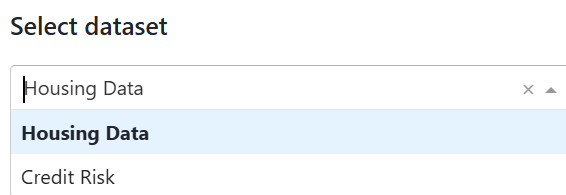
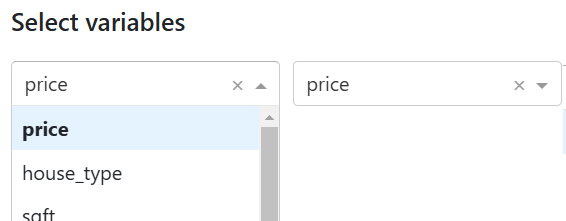
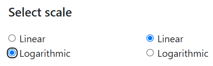
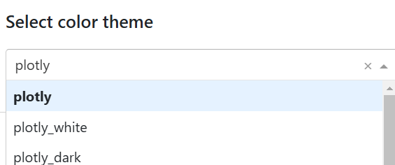
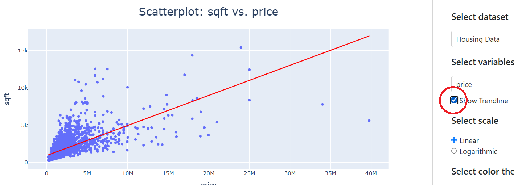
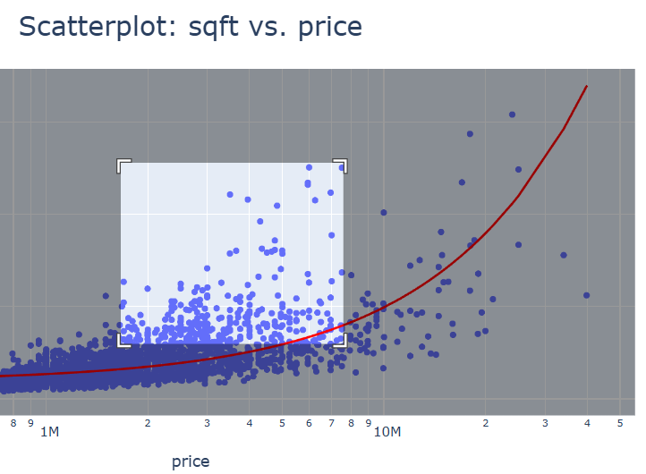
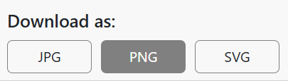

# Data Plotting App
Web app for plot generation.

An interactive economic data plotter that allows users to visualize **two datasets** through bar plots and scatter plots. Users can enhance their scatter plots by
- adding linear trendlines,
- providing valuable insights into data trends and relationships,
- customize color schemes

enabling users to tailor the visual appearance of their plots to better suit their presentation needs. Additionally, users have the option to **download** their visualizations in multiple formats, including PNG, JPG, and SVG, ensuring compatibility with various applications and platforms. This tool aims to facilitate data analysis and improve the accessibility of economic data visualization for users of all skill levels.

### Installation

```
python -m venv .venv
source .venv/bin/activate # (.venv\Scripts\activate for Windows)
pip install -r requirements.txt
```
### Usage

```
source .venv/bin/activate # (.venv\Scripts\activate for Windows)
python -m app
```

Go to [http://127.0.0.1:8000/](http://127.0.0.1:8000/) in your browser.

1. You can now plot the data by selecting columns, scales and color theme.







2. You can zoom the plot by selecting a rectangle area on the plot with the mouse.



3. Finally, you can download the plot in one of the following formats: PNG, JPG, SVG.


